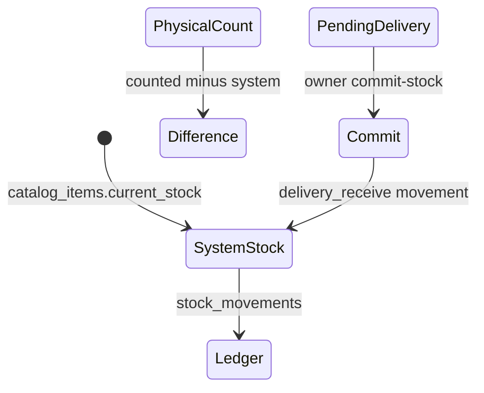

# 04 — STOCK MODULE REDESIGN

**Purpose:** Implementation-ready field dictionary, workflows, and wireframes (ASCII)  
**Schemas:** `backend/app/schemas/stock.py` — `StockListItemOut`, `StockDetailOut`  
**Audit date:** 2026-06-03

---

## 1. Concept model



| Concept | Storage | API |
|---------|---------|-----|
| System qty | `catalog_items.current_stock` | `PATCH /stock/{id}`, list |
| Version | `catalog_items.stock_version` | Query param on PATCH |
| Physical snapshot | `stock_physical_counts` | `POST physical-count` |
| Ledger | `stock_movements` | `GET …/movements` |
| Pending inbound | Trade `delivery_status` ≠ committed | Delivery pipeline providers |

---

## 2. List row — mobile (ASCII)

```
┌─────────────────────────────────────────────┐
│ [thumb] Item name                    ₹/kg ▾ │
│         Category · Type    System: 120 kg   │
│         Physical: 118 kg   Δ -2  [chip]     │
│         [Low] [Pending delivery ×2]         │
└─────────────────────────────────────────────┘
```

**Columns (list API):**

| Field | UI label | Notes |
|-------|----------|-------|
| `id`, `name` | Title | Tap → detail |
| `current_stock` | System | Primary number |
| `physical_stock` | Physical | Last count or null |
| `stock_delta` | Δ | physical − system |
| `stock_version` | (hidden) | Send on PATCH |
| `unit_type` | kg/bag/box | Format qty |
| `low_stock_threshold` | Alert chip | |
| `pending_delivery_qty` | Badge | From trade lines |

**File:** `flutter_app/lib/features/stock/presentation/stock_page.dart`

---

## 3. Quick action sheet — mobile

**File:** `quick_stock_action_sheet.dart`

```
┌─────────────────────────────────────────────┐
│  Update stock — {item}                      │
│  ○ System   ○ Physical (count only)         │
│  ┌─────────┐  ┌─────────┐                   │
│  │ Qty     │  │ Note    │                   │
│  └─────────┘  └─────────┘                   │
│  Last: system 120 · physical 118 · v42      │
│           [ Cancel ]  [ Save ]              │
└─────────────────────────────────────────────┘
```

**Workflow:**

1. `_refreshItemFromServer()` before system save (PERF-002)  
2. PATCH with `stock_version`; retry `force=true` on stale (EH-002)  
3. Physical mode → `physical-count` OR `physical-update` per toggle state  

**Finding STK-RD-001:** Always show `stock_version` in debug footer for support.

---

## 4. Desktop — rail + table + panel

```
┌──────┬────────────────────────────────┬─────────────┐
│ Rail │ Stock table (sort, filter)     │ Side panel  │
│ Home │ ┌────┬──────┬────────┬──────┐ │ Item detail │
│ Stock│ │Name│System│Physical│ Δ    │ │ Movements   │
│ …    │ └────┴──────┴────────┴──────┘ │ Quick edit  │
└──────┴────────────────────────────────┴─────────────┘
```

**Breakpoints:** `kShellRailMin` / `kShellBottomNavMax` in `hexa_responsive.dart`

---

## 5. Detail page cards

| Card | Data source |
|------|-------------|
| System vs physical | `StockDetailOut` |
| Movement ledger | `stock_movements` paginated |
| Barcode history | `barcode_scan` traces |
| Opening stock lock | Staff 403 banner |

**Tabs:** Movements | Changes | (optional) Disputes

---

## 6. API workflow decision tree

```
User taps Save
├─ Physical observe only?
│   └─ POST physical-count (no version conflict)
├─ Physical correction?
│   └─ POST physical-update (version + tolerance)
└─ System correction?
    └─ PATCH stock/{id} (version, optional force)
```

---

## 7. Column definitions — movement ledger

| Column | Source field |
|--------|--------------|
| Date | `created_at` |
| Type | `movement_type` (delivery_receive, adjustment, …) |
| Qty Δ | `quantity_delta` |
| Balance after | `balance_after` |
| User | `created_by_name` |
| Ref | `reference_type` / `purchase_id` |

---

## 8. Redesign priorities (from audit)

| ID | Change | Effort |
|----|--------|--------|
| STK-RD-001 | Version visible to support | S |
| STK-RD-002 | Unify physical/system toggle copy | S |
| STK-RD-003 | Bulk edit pagination cap warning | M |
| STK-RD-004 | Delivery pending column on list | M |
| STK-RD-005 | Desktop side panel for movements | L |

**Depends on:** BL-003 (commit vs verify), DB-004 (indexes), PERF-001 (list slowness)

**Next:** [05_PERFORMANCE_AUDIT.md](05_PERFORMANCE_AUDIT.md), [06_REPORTS_AUDIT.md](06_REPORTS_AUDIT.md)
