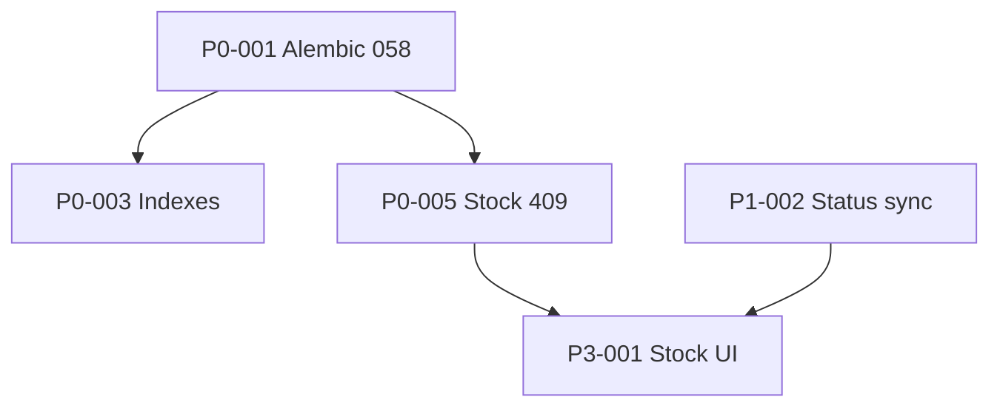

# 11 — IMPLEMENTATION ROADMAP

**Derived from:** Audits 01–09, checklist 10  
**Aligns with:** `.cursorrules` phases 1–7  
**Audit date:** 2026-06-03

---

## Phase P0 — Production blockers (1–2 weeks)

| ID | Item | Effort | Deps | Files | Acceptance |
|----|------|--------|------|-------|------------|
| P0-001 | Alembic 058 on Render | S | Ops | `alembic/` | `alembic current` = 058 |
| P0-002 | Fix Vercel hostname / project | S | Ops | `vercel.json`, DNS | `main.dart.js` content-type JS |
| P0-003 | Apply stock list indexes | M | P0-001 | `042`, SQL suggested | p95 < 1s |
| P0-004 | Staff receive snackbar | S | — | `staff_receive_shipment_page.dart` | No "system stock updated" after verify |
| P0-005 | Verify stock 409 fixes deployed | S | P0-001 | `stock.py`, `stock_version_retry.dart` | physical-count + PATCH succeed |
| P0-006 | Enable notification cron | S | Render | `internal_cron.py` | Jobs in logs |
| P0-007 | Trade reports smoke | S | — | `reports_trade.py` | KPI = history |

---

## Phase P1 — Flow alignment (2–4 weeks)

| ID | Item | Effort | Deps | Files | Acceptance |
|----|------|--------|------|-------|------------|
| P1-001 | Document dual status axes | S | — | User docs | Operators trained |
| P1-002 | Optional: sync `status` on dispatch | M | BE | `trade_purchase_service.py` | Single timeline UI |
| P1-003 | Unified commit-stock 409 JSON | S | FE | `trade_purchases.py`, hexa_api | Client parses |
| P1-004 | Period provider parity | M | FE | `app_period_provider`, reports | Same range KPI |
| P1-005 | Narrow aggregate invalidation | M | FE | `business_aggregates_invalidation.dart` | No storm after error |
| P1-006 | `delivery_discrepancies` ORM + API | L | DB-003 | models, router | CRUD or drop table |
| P1-007 | Structured integrity_error codes | M | BE | `main.py` | Client branches |

---

## Phase P2 — Cleanup (ongoing)

| ID | Item | Effort | Deps | Files | Acceptance |
|----|------|--------|------|-------|------------|
| P2-001 | Remove 5 DEPRECATED orphans | M | Zero-ref proof | cleanup list | `find_dart_orphans` clean |
| P2-002 | Deprecate Entry analytics paths | M | RPT-005 | providers | No Entry spend queries |
| P2-003 | Update MIGRATION_INDEX to 058 | S | — | `MIGRATION_INDEX.md` | Matches heads |
| P2-004 | Split hexa_api by domain | L | — | `core/api/` | Maintainable modules |

---

## Phase P3 — Stock UI redesign (4+ weeks)

| ID | Item | Effort | Deps | Files | Acceptance |
|----|------|--------|------|-------|------------|
| P3-001 | Stock list pending delivery column | M | P1 | `stock_page.dart` | STK-RD-004 |
| P3-002 | Desktop side panel movements | L | — | stock feature | STK-RD-005 |
| P3-003 | Physical/system toggle UX | S | P0-005 | `quick_stock_action_sheet.dart` | STK-RD-002 |

---

## Phase alignment (.cursorrules)

| Cursor phase | Roadmap |
|--------------|---------|
| Phase 1 App flow | P0-002, shell fixes done |
| Phase 2 Data | P0-007, P1-004, trade SSOT |
| Phase 3 Dashboard | P1-004, UX-004 |
| Phase 4 Item system | P2 backlog |
| Phase 5 Reports | P0-007, P1-004 |
| Phase 6 Alerts/PDF | P0-006, P2 |
| Phase 7 Production | PR-001–026 checklist |

---

## Effort legend

- **S:** < 1 day  
- **M:** 2–5 days  
- **L:** 1–2 weeks  

---

## Dependency graph

**Next:** [12_MASTER_TODO_LIST.md](12_MASTER_TODO_LIST.md)
